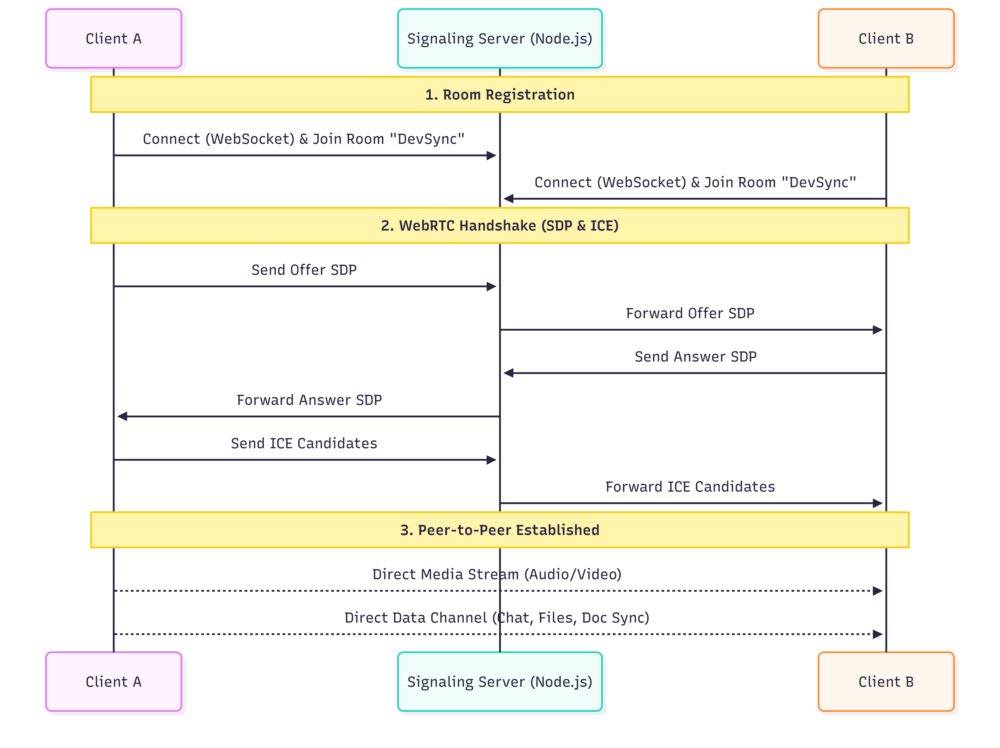
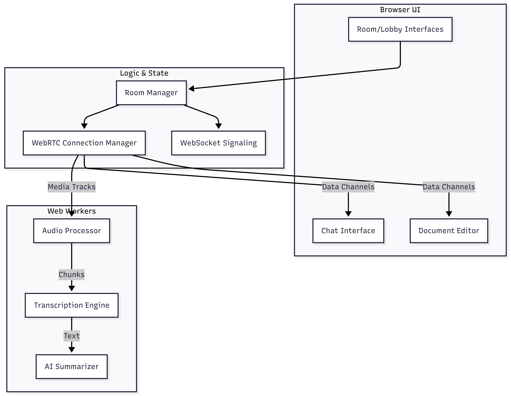

---

# PeerSpace: Decentralized P2P Collaboration Platform

## Overview

PeerSpace is a comprehensive "serverless" communication environment designed to maximize privacy, reduce latency, and lower server costs. By leveraging WebRTC, PeerSpace routes media and data directly between users. A lightweight Node.js signaling server is only used for the initial connection handshake. Once peers discover each other, the signaling server steps out of the way, and all interactions—from video streams to file transfers—occur strictly peer-to-peer.

## Key Features

* **Peer-to-Peer Audio/Video:** High-quality, low-latency media streaming directly between users.
* **Real-Time Text Chat:** Encrypted direct messaging over WebRTC Data Channels.
* **Collaborative Document Sync:** Real-time, conflict-free shared notepad editing utilizing decentralized storage mechanisms.
* **P2P File Transfer:** Direct file sharing of any size without uploading to an intermediary server.
* **AI-Powered Transcription:** Local, browser-based audio processing using Web Workers for real-time speech-to-text.
* **Automated Summarization:** Built-in summarization worker to generate meeting notes and highlights on the fly without sending audio to third-party APIs.

## Architecture

The system utilizes a hybrid architecture: centralized signaling for discovery, and purely decentralized WebRTC for all heavy lifting.

### Connection Sequence (UML)



### Client Component Structure (UML)




## Getting Started

### Prerequisites

* Node.js (v16.x or higher recommended)
* A modern web browser with WebRTC and Web Worker support (Chrome, Firefox, Edge, Safari)

### Installation

1. **Clone the repository:**
```bash
git clone <repository-url>
cd serverless-comm

```


2. **Start the Signaling Server:**
Navigate to the server directory, install dependencies (if any `package.json` exists, otherwise it relies on standard modules or minimal WS libraries), and run the server.
```bash
cd server
npm install   # If package.json is present
node server.js

```


3. **Serve the Client Application:**
Because the application utilizes Web Workers and WebRTC, it must be served over `http://localhost` or `https://`. Do not open the HTML files directly via `file://`.
You can use any static server:
```bash
npx serve peerspace/
# OR
python3 -m http.server -d peerspace/ 8080

```


## Usage

1. Open the client application in your browser (e.g., `http://localhost:8080`).
2. Enter a **Room ID** and your **Username** in the lobby.
3. Allow camera and microphone permissions.
4. Share the Room ID with a colleague.
5. Once they join, the peer-to-peer connection will establish automatically.
6. Use the side panels to chat, transfer files, edit the shared document, or view real-time transcriptions.

## Directory Structure

```text
serverless-comm/
├── peerspace/                 # Client-side application
│   ├── index.html             # Lobby/Entry point
│   ├── room.html              # Main collaboration workspace
│   ├── css/                   # Stylesheets
│   ├── js/                    # Core Client Logic
│   │   ├── config.js          # App configurations (ICE servers, etc.)
│   │   ├── signaling.js       # WebSocket communication logic
│   │   ├── connection.js      # RTCPeerConnection wrapper
│   │   ├── room.js            # UI and DOM state management
│   │   ├── chat.js            # P2P Messaging
│   │   ├── file-transfer.js   # P2P File handling
│   │   ├── doc-sync.js        # Collaborative editing logic
│   │   ├── transcription.js   # Speech-to-text UI logic
│   │   ├── transcript-store.js# Local transcript state
│   │   └── workers/           # Heavy lifting off main thread
│   │       ├── audio-processor.js
│   │       ├── transcription.worker.js
│   │       └── summarizer.worker.js
├── server/                    # Signaling Server
│   └── server.js              # Node.js connection broker
└── p2p-webrtc.mermaid         # Architecture reference diagram

```